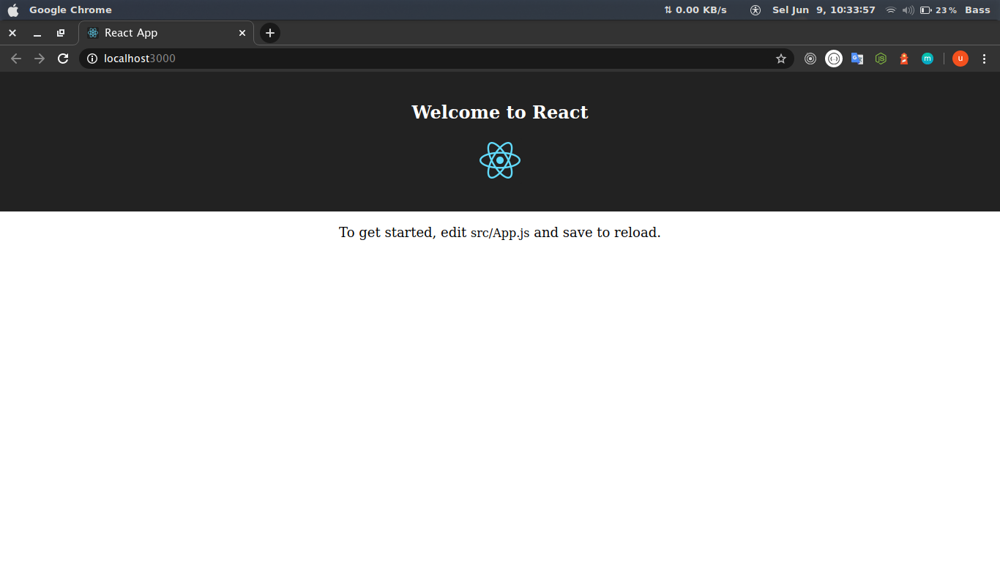
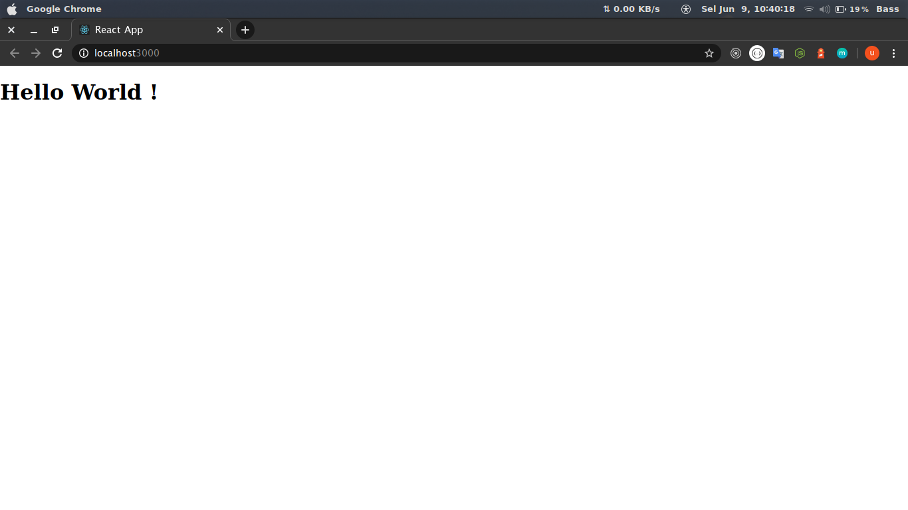

### Apa itu ReactJs ?

React (juga dikenal sebagai React.js atau ReactJS) adalah pustaka JavaScript open-source untuk membangun antarmuka pengguna. ReactJs dikelola oleh Facebook dan komunitas pengembang dan perusahaan individu. 

### Hello World ReactJs

1. Install Node Package Manager

Sebelum install project React Js , harus menginstall npm terlebih dahulu. Adapun cara installasinya bisa dilihat di halaman panduan instalasi langsung di website Node.js [disini](https://nodejs.org/en/download/package-manager/)

2. Install project React Js

Sudah install npm nya , coba cek terlebih dahulu dengan terminal atau command prompt dengan 

```bash
node -v
```

atau 

```bash
node --version
```

jika sudah terinstall maka akan muncul versi Node.js yang telah kamu install.

Selanjutnya install project React Js

```bash
npx create-react-app my-project
```

3. Masuk ke folder _my-project_

```bash
cd my-project
```

4. Jalankan aplikasi

```bash
npm start
```

maka tampilan akan seperti ini



5. Masuk ke src/App.js dan ubah kode menjadi seperti ini

```javascript
import React, { Component } from 'react';
import Icon from "../public/favicon.ico";
import './App.css';

class App extends Component {
  render() {
    return (
      <h1>Hello World !</h1>
    );
  }
}

export default App;
```

dan tara ..




sekarang kamu berhasil membuat aplikasi pertamamu dengan ReactJs

### Selanjutnya Apa ?

pelajari tentang component , state , props , lifecycle dalam ReactJs dengan melihat dokumentasinya di [sini](https://reactjs.org/docs)
